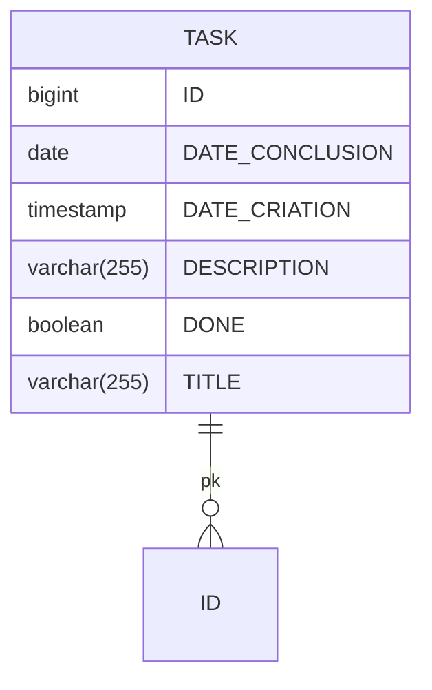

# 📝 To-Do List API

API completa de gerenciamento de tarefas desenvolvida com Spring Boot 3.5 e H2 Database, seguindo princípios RESTful e boas práticas de desenvolvimento.

[](https://www.oracle.com/java/)
[](https://spring.io/projects/spring-boot)
[](https://github.com/Gabransel/toDoList/blob/main/LICENSE)
[](https://www.h2database.com)

## ✨ Funcionalidades Principais

- ✅ **CRUD Completo** de tarefas
- 🔍 Busca avançada por:
  - Título (contendo texto, case insensitive)
  - Data de conclusão
- ⏱️ Verificação automática de status:
  - Tarefas concluídas
  - Tarefas atrasadas (com mensagens personalizadas)
- 🗃️ Banco de dados H2 com:
  - Console web para administração
  - Configuração automática de schema
- 🛡️ Validação de dados com mensagens claras

## 🚀 Stack Tecnológica

### Backend
- **Linguagem**: Java 17
- **Framework**: Spring Boot 3.5.0
- **Persistence**: 
  - Spring Data JPA
  - Hibernate Validator
  - Hibernate 6.6.15

### Banco de Dados
- **H2 Database** (modo memória)
- **Console H2** para visualização dos dados

### Ferramentas
- **Build**: Maven 3.8+
- **Testes**: Postman/Insomnia
- **Documentação**: Swagger (opcional)

## 📦 Pré-requisitos

- Java JDK 17+ ([Download](https://www.oracle.com/java/technologies/javase-jdk17-downloads.html))
- Maven 3.8+ ([Instalação](https://maven.apache.org/install.html))
- Git ([Download](https://git-scm.com/))
- Postman ou Insomnia (recomendado para testes)


## 🔧 Instalação e Execução

1. **Clone o repositório**:
   ```bash
   git clone https://github.com/Gabransel/toDoList.git
   cd toDoList
  
## 🔧 Instalação e Execução

1. Clone o repositório:
   ```bash
   git clone https://github.com/Gabransel/toDoList.git
   cd toDoList
2. Execute a aplicação:
   ```bash
    mvn spring-boot:run
3. Acesse a API em:

    http://localhost:8080/api/tasks

##🛠️ Acesso ao Banco de Dados H2

1. Com a aplicação rodando, acesse:
   http://localhost:8080/api/h2-console
2. Informe as credenciais:
   JDBC URL: jdbc:h2:mem:taskdb
   User Name: sa
   Password: (deixe vazio)


## 🗃️ Modelo do Banco de Dados

A aplicação utiliza uma única tabela para armazenar as tarefas:



### Descrição dos Campos

| Campo           | Tipo         | Descrição                                  |
|-----------------|--------------|--------------------------------------------|
| ID              | BIGINT       | Chave primária autoincrementada            |
| TITLE           | VARCHAR(255) | Título da tarefa (obrigatório)             |
| DESCRIPTION     | VARCHAR(255) | Descrição detalhada (opcional)             |
| DATE_CONCLUSION | DATE         | Data prevista para conclusão (obrigatório) |
| DATE_CRIATION   | TIMESTAMP    | Data de criação automática                 |
| DONE            | BOOLEAN      | Status de conclusão (default: false)       |

## 📝 Exemplo de Uso

Criar tarefa:
  ```bash
    curl -X POST http://localhost:8080/api/tarefas \
  -H "Content-Type: application/json" \
  -d '{"titulo":"Estudar Spring Boot","dataConclusao":"2023-12-31"}'
  ```

Listar tarefas:
  ```bash
    curl http://localhost:8080/api/tarefas
  ```
